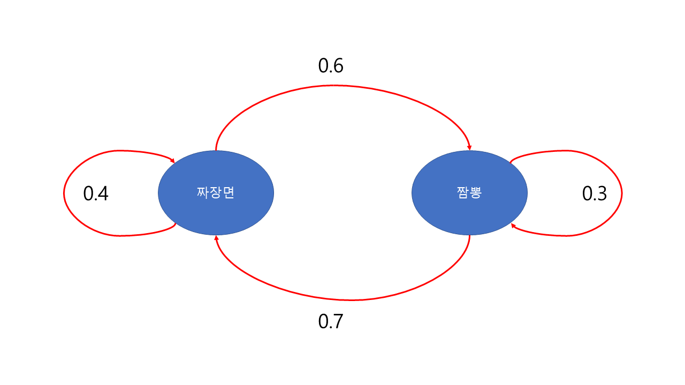
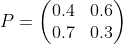
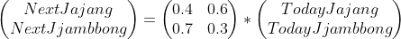
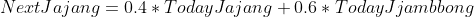
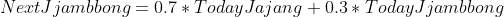

## Markov Chain을 통한 N년 후 시, 도 별 인구 현황 예측

* **MarkovChain**이란?

  - 시간에 따른 계의 상태의 변화

  

* 예시

  - 우리 동네에는 유명한 중국집이 있다. 이 중국집은 저번주에 짜장면을 시킨 사람 중 40%만이 이번주에 짜장면을 시키고, 저번주에 짬뽕을 시켰던 사람들 중 30%만이 이번주에도 짬뽕을 시킨다.

  

  - 다음을 **시각적인 그림**으로 나타내보자.

  

  * 이를 **표**로 나타내면?

    |            | 짜장면으로 | 짬뽕으로 |
    | ---------- | ---------- | -------- |
    | 짜장면에서 | 0.4        | 0.6      |
    | 짬뽕에서   | 0.7        | 0.3      |

    

  

  * **행렬**로 나타내면?    
  
      
    
    
    - 이 행렬을 **Markov Matrix**라고 한다.

  

  사실 이 **Markov Process**에는 조건이 존재한다.

  - 조건
    + 과거와 현재의 상태가 주어질 때 미래 상태의 확률 분포가 과거상태와는 독립적으로 현재 상태에 의해서만 결정되어야 한다. 즉 위의 상황에서 다음주의 짜장면과 짬뽕을 시킬 확률은 저번주와 이번주에 해당 중국집에 주문한 사람들에 의해서 동일한 확률로 결정되어야 한다.

  사실 이 조건을 만족시키기는 __굉장히 어렵다__. 위에서 가정한 상황에서만 봐도 해당 중국집이 갑작스런 공중파 방송을 타서 맛집으로 소문날 수도 있고, 짬뽕 예찬론자들이 동네에 이사와 갑작스런 짬뽕의 압승이 이루어질 수도 있는것이다. 하지만 다음 조건이 만족 된다면 얻게되는 이득도 적지 않다.

  

  * **Markov Matrix** 특성

    * 각각의 원소는 0 이상이다.
    * 행의 합은 항상 1이다.

    

  또한 위의 가정에서 다음과 같은 결론도 낼 수 있다.

  

  * **다음 주**

  
  
  

  식으로는 다음과 같다.
  

  
  
  

  

  즉, 이번주에 200명의 손님이 짜장면을 시켜 먹고, 100명의 손님이 짬뽕을 시켜먹었다고 가정할 때, **다음주에는 140명의 손님이 짜장면을 먹고 60명의 손님이 짜장면을 시켜먹을 것이다.**

  

  

  

  

